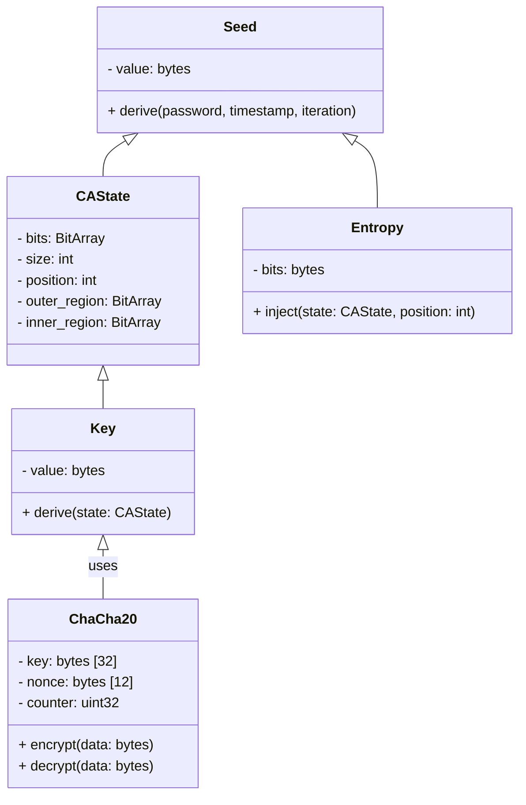

# 2. Data Types and Structure

## 2.1 Data Structures

**Note:** The UML diagram below is the authoritative source for all structure layouts.

## 2.2 Data Type Definitions

| Name      | Type / Structure | Description |
|-----------|------------------|-------------|
| BitArray  | Array of bits    | Efficient, indexable bit sequence used for CA state and regions. |
| CAState   | Object           | Holds the evolving 1D bit array, with fields for size, position, and regions. |
| Seed      | Object           | Contains the initial entropy source, derived from password, timestamp, and iteration. |
| Entropy   | Object           | Encapsulates randomness injected into CAState at specific positions. |
| Key       | Object           | Final cryptographic key, derived from CAState after all evolutions. |
| ChaCha20  | Object           | Stream cipher: 32-byte key, 12-byte nonce, 4-byte counter; generates keystream for encryption/decryption. |
| password  | string/bytes     | User-supplied secret for seed derivation. |
| timestamp | int              | System time used in seed derivation. |
| iteration | int              | Iteration count for seed and CA evolution. |
| nonce     | bytes [12]       | Unique value for ChaCha20 encryption, prevents keystream reuse. |
| counter   | uint32           | Block counter for ChaCha20, ensures unique keystream blocks. |