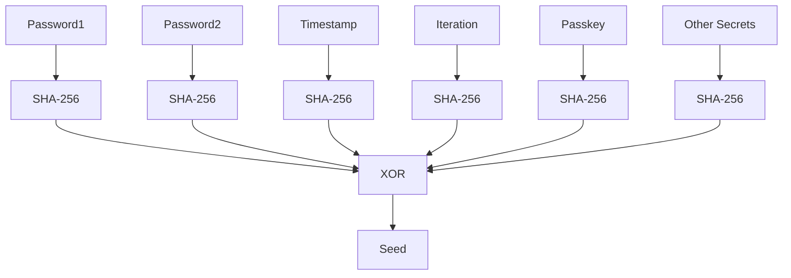

# 3. Seed Derivation

| Input      | Operation                | Output |
|------------|--------------------------|--------|
| Password1  | SHA-256                  | H1     |
| Password2  | SHA-256                  | H2     |
| other secrets | SHA-256               | H5     |
| Timestamp  | SHA-256                  | H3     |
| Iteration  | SHA-256                  | H4     |
| H1, H2, H3, (H4) | XOR                | Seed   |

**Security Note:**
At least two secrets must be strong and confidential. If only one is unknown, brute-force is possible. With two or more unknown, recovery is infeasible. XOR allows any number of secrets in any order.
