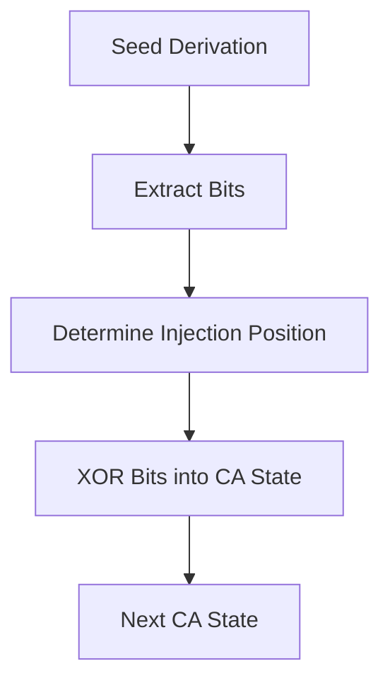

# 4. Entropy Injection

| Step           | Description |
|----------------|-------------|
| Seed Derivation| Derive a seed from password, timestamp, iteration |
| Bit Extraction | Convert the seed into a series of bits |
| XOR Injection  | XOR these bits into the CA state at a seed-determined position |

**Security Implications:**
- Prevents steady states and trivial attractors
- Makes state reversal and prediction infeasible
