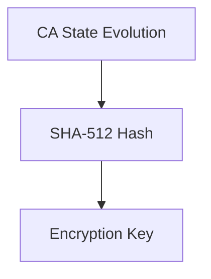

# 6. Key Derivation

| Step      | Description |
|-----------|-------------|
| Evolution | CA evolves for N iterations |
| Hashing   | Hash final CA state with SHA-512 |
| Output    | Use digest as derived encryption key |

