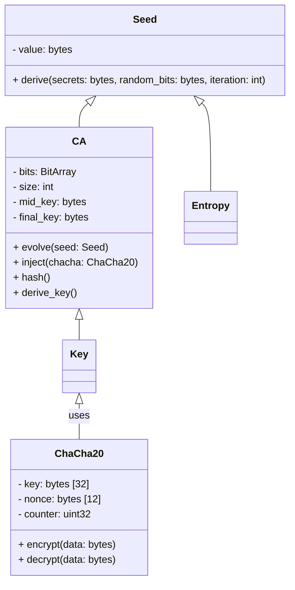

# 2. Data Types and Structure

## 2.1 Data Structures

**Note:** The UML diagram below is the authoritative source for all structure layouts.

## 2.2 Data Type Definitions

| Name      | Type / Structure | Description |
|-----------|------------------|-------------|
| BitArray  | Array of bits    | Efficient, indexable bit sequence used for CA state. |
| CAState   | Object           | Holds the evolving 1D bit array, with fields for size and position. |
| Seed      | Object           | Contains the initial entropy source, derived from password, a cryptographically secure random bitstring, and key-derivation step. |
| Entropy   | Object           | Encapsulates randomness injected into CAState at each evolution. |
| Key       | Object           | Final cryptographic key, derived as follows: At the evolution where (iteration mod value of seed bits [-10:-5]) == 0, a pre-final key is computed as SHA-512 of the full universe. After all evolutions, the final key is computed as SHA-512 of the final universe, and the output key is the XOR of pre-final and final keys. |
| ChaCha20  | Object           | Stream cipher: 32-byte key, 12-byte nonce, 4-byte counter; generates keystream for entropy injection. |
| password  | string/bytes     | User-supplied secret for seed derivation. |
| random_bits | bytes          | Cryptographically secure random bitstring used in seed derivation. |
| key-derivation step | int    | Step count for seed and CA evolution. |
| nonce     | bytes [12]       | Unique value for ChaCha20 entropy injection, prevents keystream reuse. |
| counter   | uint32           | Block counter for ChaCha20, ensures unique keystream blocks. |