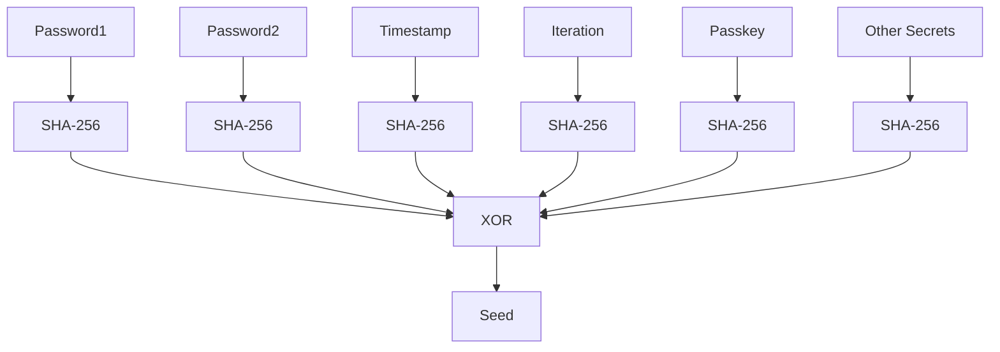

# 3. Seed Derivation

## Overview

The seed is derived from user and system secrets, and is used to:
- Initialize the single-universe CA state
- Select the meta-rule encoding for each evolution (see [Spec 4])
- Determine the random evolution index for pre-final key extraction in Dual Point Derivation (see [Spec 6])

Seed bits are partitioned as follows:
- Lower bits: Used for meta-rule encoding and dynamic rule selection
- Upper bits: Used for random evolution count and pre-final key index in Dual Point Derivation

| Input      | Operation                | Output |
|------------|--------------------------|--------|
| Password1  | SHA-256                  | H1     |
| Password2  | SHA-256                  | H2     |
| other secrets | SHA-256               | H5     |
| Timestamp  | SHA-256                  | H3     |
| Iteration  | SHA-256                  | H4     |
| H1, H2, H3, (H4) | XOR                | Seed   |

**Security Note:**
- At least two secrets must be strong and confidential. If only one is unknown, brute-force is possible. With two or more unknown, recovery is infeasible. XOR allows any number of secrets in any order.
- The use of seed bits for meta-rule and evolution index selection makes targeted attacks and prediction of CA evolution or rule schedule highly impractical.
