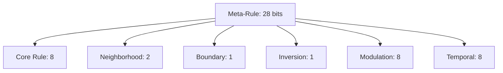

# 4. Rule Space and Dynamic Rule Encoding

## Meta-Rule Encoding Table

| Field                | Bits | Description                                      | Values/Options                      |
|----------------------|------|--------------------------------------------------|-------------------------------------|
| Core Rule            | 8    | Elementary CA rule (e.g., Rule 110)              | 0–255 (all 3-neighbor binary rules) |
| Neighborhood Size    | 2    | Number of cells in neighborhood                  | 3, 4, 5, 6                         |
| Boundary Condition   | 1    | Universe edge handling                           | Toroidal / Finite                   |
| Inversion Mode       | 1    | Output inversion                                 | Normal / Inverted                   |
| Rule Modulation      | 8    | Transformation function (mask, permutation, etc.) | 0–255                              |
| Temporal Evolution   | 8    | Rule mutation per evolution                      | 0–255                              |

**Total: 28 bits per meta-rule**

## Rule Space Diagram



## Combinatorial Explosion

- **Static Rule Space:** 2²⁸ = 268,435,456 possible rules
- **Dynamic Evolution:** Each evolution can select a new meta-rule, so after k evolutions: (2²⁸)ᵏ possibilities
- **Security Impact:** Brute-force complexity grows exponentially with the number of evolutions and meta-rule changes
    # Derive 256-bit master seed
    seed = hashlib.blake2b(password + salt).digest()
    # Initialize ChaCha20 for rule generation
    rule_rng = chacha20.ChaCha20(
        key=seed[:32],
        nonce=seed[32:44]
    )
    for i in range(evolutions):
        # Generate 32-bit rule descriptor
        rule_bits = int.from_bytes(rule_rng.encrypt(b'\0'*4), 'big')
        rule = decode_rule(rule_bits)
        apply_dynamic_rule(rule)
        rule_rng.seek(rule['temporal'] % 1024)
```

## Security Implications
- **Combinatorial Depth:**
  - Each evolution multiplies attack complexity by 268 million
  - 10 evolutions → 10²⁸⁵ attack space
  - 100 evolutions → larger than number of atoms in observable universe
- **Cryptographic Binding:**
  - Rules derived from cryptographically secure RNG
  - Rule evolution depends on previous states
  - No two rule sequences are identical
- **Quantum Resistance:**
  - 28 × k-bit security exceeds Grover's algorithm capability
  - 100 evolutions → 2,800-bit security against quantum

## Optimization Notes
- **Memory Efficiency:**
  - Only 4 bytes per rule needed
  - 1M evolutions = 4MB storage (acceptable)
- **Acceleration Techniques:**
  - Precompute common rule configurations
  - Use JIT compilation for rule application
  - Parallelize across independent CA segments
- **Alternative Encoding:**
```python
# 24-bit version (if space constrained)
rule_bits = (core_rule) | (neighborhood << 8) | (boundary << 10) | (inversion << 11) | (modulation << 12)
# 16.7 million possibilities (still sufficient)
```

This 28-bit rule encoding creates an enormous combinatorial space that grows exponentially with each evolution, making exhaustive search attacks completely infeasible while maintaining practical implementability.
