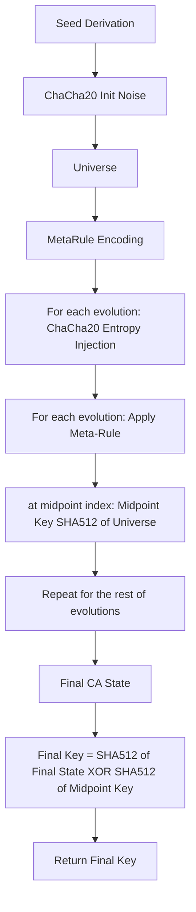

# 5. Universe Evolution

| Component         | Description |
|-------------------|-------------|
| Universe          | Fixed-size array (e.g., 1024 cells) defines the full CA state; astronomical state space; compact bit-level storage. |
| ChaCha20 Init     | Universe pre-initialized with ChaCha20 CSPRNG using seed-derived key and nonce; ensures high-entropy, noise-filled start. |
| Meta-Rule         | Each evolution uses a dynamically encoded rule (see Spec 4), derived from the meta-rule bits in the seed and ChaCha20 output. |
| Evolution         | For each key-derivation step, the number of evolutions is (last 5 bits of seed, min=1) × universe size. At each evolution, the meta-rule may change. |
| Random Pre-Final Key | At the evolution where (evolution index mod value of seed bits [-10:-5]) == 0, a pre-final key is computed as SHA-512 of the full universe. |
| Final Key         | After all evolutions, the final key is computed as SHA-512 of the final universe, and the output key is the XOR of pre-final and final keys. |
| Entropy Injection | All seed injection and per-evolution entropy is performed via ChaCha20 output. |
| Irreversibility   | ChaCha20-based entropy injection, meta-rule evolution, and CA evolution make reversal impossible. |
| Impact            | Massive rule/key space; noise-filled init prevents weak states; deterministic and reproducible; minimal memory footprint. State verification is not included in the current design. |

